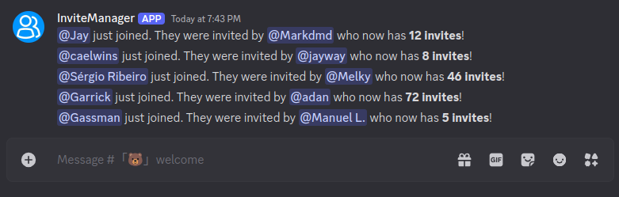

# A bot designed to manage Discord server invites and role-based rewards.

This bot provides an intuitive solution for tracking invites and managing role-based rewards on your Discord server. It simplifies rewarding users for invites with a flexible system, allowing admins to easily monitor activity and incentivize community growth.

Key features include two main commands:

/invite: View a user's invite count to track their contributions.

/reward: Manage role-based rewards, allowing admins to assign or remove rewards based on invite milestones.

<div align='center'>  
      
</div>  

## Features  

✔️ **New Member Notifications** – Announces new members and their inviter in the system channel by default.  
✔️ **Invite Tracking** – Keeps track of each member’s total invites.  
✔️ **Role-Based Rewards** – Create, delete, and view invite-based role rewards.  

---

# Member Join Notification

The bot will send a notification to the system channel when a new member joins the server. The notification includes the member's username and their inviter's username.

<div align='center'>  
      
</div>

# Invite Command  

The `/invite` command allows users to check their current number of invites or view another user's invites.  

<div align='center'>  
      
      
</div>  

---

# Reward Command  

## Creating a Reward  

The `/reward create` command is used to set up a new invite-based role reward.  

### Required Parameters:  
- **Role** – The role granted to a member upon reaching the required number of invites.  
- **Invites** – The number of invites needed to earn the reward.  

<div align='center'>  
      
      
</div>  

Once a role reward is active, the invite card will display the number of invites required to obtain it.  

<div align='center'>  
      
      
</div>

## Checking Rewards  

The `/reward list` command is used to view all active invite-based role rewards.  

<div align='center'>  
      
</div>

## Deleting a Reward  

The `/reward delete` command is used to remove an invite-based role reward.

### Required Parameters:

- **Role** – The role associated with the reward.

<div align='center'>  
    
    
</div>

## Installation

### 1. Clone this repository:

```bash
git clone repository.git
cd repository
```

### 2. Install dependencies:

```bash
npm install
```

### 3. Create a .env file in the project's root directory with the following content:

```bash
SERVER_HOST=your-server-host
DISCORD_BOT_TOKEN=your-discord-bot-token
DISCORD_CLIENT_ID=your-discord-client-id
DISCORD_CLIENT_SECRET=your-discord-client-secret
DATABASE_NAME=your-database-name
DATABASE_USER=your-database-user
DATABASE_PASSWORD=your-database-password
DATABASE_PORT=your-database-port
DATABASE_PROVIDER=your-database-provider
```

Replace the placeholders with your own values.

### 4. Run the bot:

```bash
npm start
```

## Contributions

Contributions are welcome. If you'd like to contribute, please fork the repository and create a pull request with your changes.

## License

This project is licensed under the MIT License. See the LICENSE file for details.
